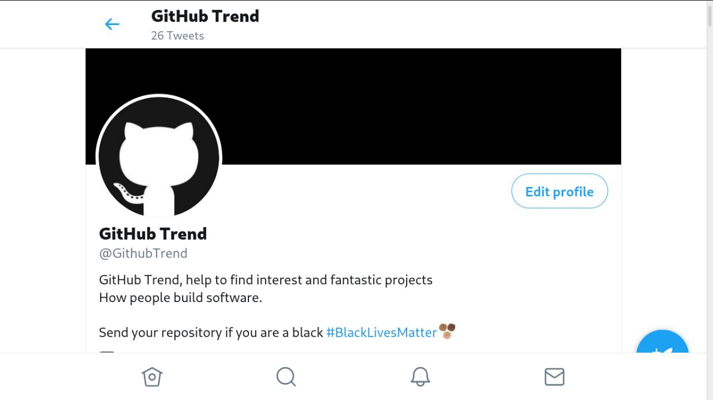

  <a href="https://twitter.com/GithubTrend" target="_blank">
  
<b>G I T H U B - T R E N D</b>
</a>
  
GitHub Trend, help to find interest and fantastic projects

# twitter-github-trend

A Tiny script to send tweet for new projects in GitHub Trending.

If you have a significant repository, send the link on Twitter....

https://twitter.com/GithubTrend

---------

**Thanks to:** Andy Smith and David Grudl

# Max Base

My nickname is Max, Programming language developer, Full-stack programmer. I love computer scientists, researchers, and compilers. ([Max Base](https://maxbase.org/))

## Asrez Team

A team includes some programmer, developer, designer, researcher(s) especially Max Base.

[Asrez Team](https://www.asrez.com/)
